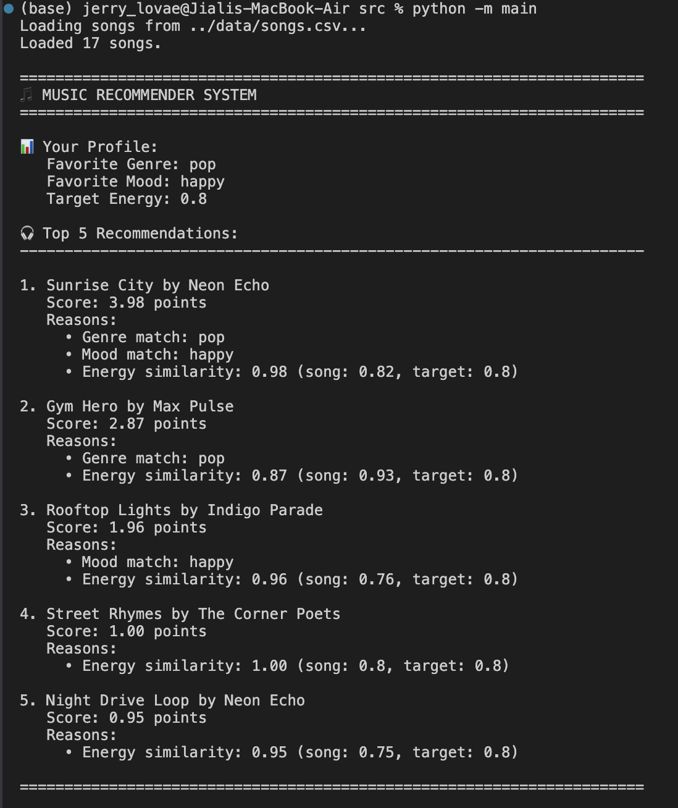

# 🎵 Music Recommender Simulation

## Project Summary

In this project you will build and explain a small music recommender system.

Your goal is to:

- Represent songs and a user "taste profile" as data
- Design a scoring rule that turns that data into recommendations
- Evaluate what your system gets right and wrong
- Reflect on how this mirrors real world AI recommenders

Real-world recommenders score each item by how well it fits a user’s preferences, then sort the items by that score. In our simulation, we will prioritize content similarity rather than popularity: songs whose `genre` and `mood` match the user’s tastes should score higher, and numerical audio features like `energy` should be rewarded when they are close to the user’s target value, not simply larger or smaller.

we will prioritize matches on `genre`, matches on `mood`, closeness of `energy` to the user’s desired energy, acoustic preference via `acousticness`, and overall content similarity and score-based ranking.

Features used by our objects

#### `Song`
- `id`
- `title`
- `artist`
- `genre`
- `mood`
- `energy`
- `tempo_bpm`
- `valence`
- `danceability`
- `acousticness`

#### `UserProfile`
- `favorite_genre`
- `favorite_mood`
- `target_energy`
- `likes_acoustic`


## How The System Works

### Data Representation

**Song Features Used:**
- `genre` — primary content tag (pop, rock, jazz, etc.)
- `mood` — emotional character (happy, chill, intense, etc.)
- `energy` — intensity level (0.0–1.0 scale)
- `tempo_bpm`, `valence`, `danceability`, `acousticness` — available for future weighting

**UserProfile Information:**
- `favorite_genre` — the user's preferred genre
- `favorite_mood` — the user's preferred mood
- `target_energy` — the user's desired energy level (0.0–1.0)
- `likes_acoustic` — whether the user prefers acoustic content

### Scoring Logic

For each song in the CSV, the recommender calculates a **weighted score**:

```
Score = (Genre Match × 2.0) + (Mood Match × 1.0) + Energy Similarity
```

**Scoring Details:**
- **Genre Match** (+2.0 points) — Song genre matches user's favorite genre
- **Mood Match** (+1.0 point) — Song mood matches user's favorite mood  
  - *Ratio: Mood matches count as 50% of genre matches, since genre is the primary preference signal*
- **Energy Similarity** (0–1.0 points) — Based on how close the song's energy is to the user's target energy
  - Formula: `1.0 - abs(song.energy - user.target_energy)`
  - Perfect match (same energy) = 1.0 point; opposite energy = 0 points

### Recommendation Process

1. **INPUT** — Receive the user's taste profile (genre, mood, target energy)
2. **PROCESS** — Loop through every song in the CSV file:
   - Calculate the weighted score for each song
   - Store songs with their scores
3. **RANKING** — Sort all scored songs in descending order by score
4. **OUTPUT** — Return the top K recommendations (default: 5 songs)

This ensures the recommender ranks songs by content similarity rather than popularity, favoring matches on core preferences (genre/mood) while rewarding songs with matching energy levels.

---

## Getting Started

### Setup

1. Create a virtual environment (optional but recommended):

   ```bash
   python -m venv .venv
   source .venv/bin/activate      # Mac or Linux
   .venv\Scripts\activate         # Windows

2. Install dependencies

```bash
pip install -r requirements.txt
```

3. Run the app:

```bash
python -m src.main
```

### Running Tests

Run the starter tests with:

```bash
pytest
```

You can add more tests in `tests/test_recommender.py`.

---

## Experiments You Tried

Use this section to document the experiments you ran. For example:

- What happened when you changed the weight on genre from 2.0 to 0.5
- What happened when you added tempo or valence to the score
- How did your system behave for different types of users



---

## Limitations and Risks

Summarize some limitations of your recommender.

Examples:

- It only works on a tiny catalog
- It does not understand lyrics or language
- It might over favor one genre or mood

You will go deeper on this in your model card.

---

## Reflection

Read and complete `model_card.md`:

[**Model Card**](model_card.md)

Write 1 to 2 paragraphs here about what you learned:

- about how recommenders turn data into predictions
- about where bias or unfairness could show up in systems like this


---

## 7. `model_card_template.md`

Combines reflection and model card framing from the Module 3 guidance. :contentReference[oaicite:2]{index=2}  

```markdown
# 🎧 Model Card - Music Recommender Simulation

## 1. Model Name

Give your recommender a name, for example:

> VibeFinder 1.0

---

## 2. Intended Use

- What is this system trying to do
- Who is it for

Example:

> This model suggests 3 to 5 songs from a small catalog based on a user's preferred genre, mood, and energy level. It is for classroom exploration only, not for real users.

---

## 3. How It Works (Short Explanation)

Describe your scoring logic in plain language.

- What features of each song does it consider
- What information about the user does it use
- How does it turn those into a number

Try to avoid code in this section, treat it like an explanation to a non programmer.

---

## 4. Data

Describe your dataset.

- How many songs are in `data/songs.csv`
- Did you add or remove any songs
- What kinds of genres or moods are represented
- Whose taste does this data mostly reflect

---

## 5. Strengths

Where does your recommender work well

You can think about:
- Situations where the top results "felt right"
- Particular user profiles it served well
- Simplicity or transparency benefits

---

## 6. Limitations and Bias

Where does your recommender struggle

Some prompts:
- Does it ignore some genres or moods
- Does it treat all users as if they have the same taste shape
- Is it biased toward high energy or one genre by default
- How could this be unfair if used in a real product

---

## 7. Evaluation

How did you check your system

Examples:
- You tried multiple user profiles and wrote down whether the results matched your expectations
- You compared your simulation to what a real app like Spotify or YouTube tends to recommend
- You wrote tests for your scoring logic

You do not need a numeric metric, but if you used one, explain what it measures.

---

## 8. Future Work

If you had more time, how would you improve this recommender

Examples:

- Add support for multiple users and "group vibe" recommendations
- Balance diversity of songs instead of always picking the closest match
- Use more features, like tempo ranges or lyric themes

---

## 9. Personal Reflection

A few sentences about what you learned:

- What surprised you about how your system behaved
- How did building this change how you think about real music recommenders
- Where do you think human judgment still matters, even if the model seems "smart"

